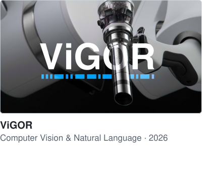
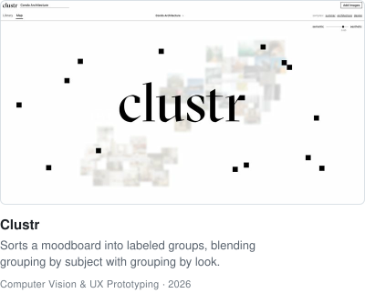
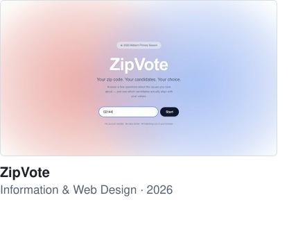
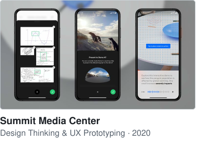

### Selected work

<a href="https://patrickknguyen.github.io/vigor/"><picture><source media="(prefers-color-scheme: dark)" srcset="cards/vigor-dark.svg"></picture></a>&nbsp;&nbsp;&nbsp;<a href="https://patrickknguyen.github.io/clustr/"><picture><source media="(prefers-color-scheme: dark)" srcset="cards/clustr-dark.svg"></picture></a>

<a href="https://patrickknguyen.github.io/zipvote/"><picture><source media="(prefers-color-scheme: dark)" srcset="cards/zipvote-dark.svg"></picture></a>&nbsp;&nbsp;&nbsp;<a href="https://patrickknguyen.github.io/summit/"><picture><source media="(prefers-color-scheme: dark)" srcset="cards/summit-dark.svg"></picture></a>

